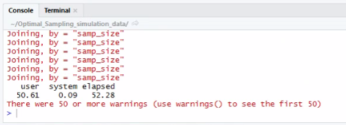
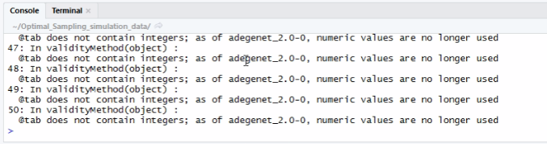

# Optimal Sampling

### Aims
1. Determination of optimal sampling for accurate estimates of genetic diversity
2. Determination of optimal number of loci for accurate estimates of genetic diversity

### Description
- One script for He, Ho, Ar, Allele detection (calculation & pdf output).
- One script for FST, Jost's D, Cavalli-Sforza chord distance (calculation & pdf output).
- Two more scripts containing code to produce compact pdf outputs, displaying statistics only for sample sizes of 25, 30, 50, 75 individuals.

### Before running the scripts

- The scripts' input file is a GenAlEx formatted excel sheet just like the one SFI, ASP and AUTH share for the common LGM data set. Because loci rank is determined based on the pooled empirical data set, a new excel sheet has to be created containing all the loci intended to be analyzed. If a locus has not been genotyped for all populations, it should be added as missing data. Note that the only statistic that is calculated from this pooled data set is loci rank. All other statistics are calculated on per population basis.

- Note that population names are hardcoded and should be **exactly** the following in the GenAlEx input file: 
**SL_Adult, SL_Regen, SL_Seed, DE_Adult, DE_Regen, DE_Seed, GR_Adult, GR_Regen, GR_Seed**

- Note that the number of individuals in each population is hardcoded as following:

    - "Abies_DE_Adult", "Abies_GR_Adult", "Fagus_DE_Adult", "Fagus_GR_Adult": **250** trees
    - "Abies_SL_Adult": **249** trees
    - "Fagus_SL_Adult": **251** trees
    - "Abies_DE_Regen", "Abies_GR_Regen", "Abies_SL_Regen","Fagus_DE_Regen", "Fagus_GR_Regen", "Fagus_SL_Regen": **200** trees
    - "Abies_DE_Seed","Abies_SL_Seed","Fagus_DE_Seed", "Fagus_GR_Seed", "Fagus_SL_Seed": **400** trees
    - "Abies_GR_Seed": **382** trees

Please notify for any discrepancy.

### Using the script

- The scripts has been tested to work on R 3.5.1 . The following guide assumes you are using the Rstudio application. 
- The scripts has to be run individually for each population. 
- To run the commands, place the cursor on line and press Ctrl + Enter
    - open rstudio by double clicking on 
    - place cursor on first library line and press Ctrl + Enter
    - load excel input file: set the name of excel file and name of the sheet where the genotypes reside and press Ctrl + Enter
    - set species name
    - set population name
    - set replication number

- Placing the cursor on a line, excecutes the code in this line

- Warnings (include images)

