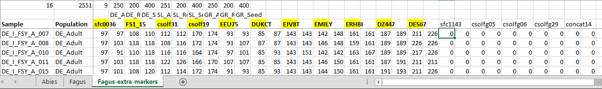

---
output:
  html_document: default
  pdf_document: default
---
# Optimal Sampling

### Aims
1. Determination of optimal sampling for accurate estimates of genetic diversity
2. Determination of optimal number of loci for accurate estimates of genetic diversity

### Description
- One script for H<sub>e</sub>, H<sub>o</sub>, Ar, Allele detection.
- One script for F<sub>ST</sub>, Jost's D, Cavalli-Sforza chord distance.

### Before running the scripts

- The scripts' input file is a GenAlEx formatted excel sheet just like the one SFI, ASP and AUTH share for the common LGM data set. Because loci rank is determined based on the pooled empirical data set, a new excel sheet has to be created containing all the loci intended to be analyzed. Even if a locus has not been genotyped for a population, it should be added as missing data. Note that the only statistic that is calculated from this pooled data set is loci rank. All other statistics are calculated on per population basis.


- Note that population names are hardcoded and should be **exactly** the following in the GenAlEx input file: 
**SL_Adult, SL_Regen, SL_Seed, DE_Adult, DE_Regen, DE_Seed, GR_Adult, GR_Regen, GR_Seed**

- Note that the number of individuals in each population is hardcoded as following:

    - "Abies_DE_Adult", "Abies_GR_Adult", "Fagus_DE_Adult", "Fagus_GR_Adult": **250** trees
    - "Abies_SL_Adult": **249** trees
    - "Fagus_SL_Adult": **251** trees
    - "Abies_DE_Regen", "Abies_GR_Regen", "Abies_SL_Regen","Fagus_DE_Regen", "Fagus_GR_Regen", "Fagus_SL_Regen": **200** trees
    - "Abies_DE_Seed","Abies_SL_Seed","Fagus_DE_Seed", "Fagus_GR_Seed", "Fagus_SL_Seed": **400** trees
    - "Abies_GR_Seed": **382** trees

Please notify for any discrepancy for the above numbers.

### Using the script

- The scripts have been verified to work on R 3.5.1 . The following guide assumes you are using the Rstudio IDE. 

- After opening the script in RStudio, navigate to the "Setup" section of the script by clicking the button on the lower left corner of RStudio's built in text editor.

- In the "Setup" section fill in:

    1. the name of the excel input file
    2. the name of the sheet where genotypes reside
    3. the species name ("Abies" or "Fagus")
    4. the population name (according to the names specified above)
    5. the number of replications (defaults to 100)


- It is also possible to omit the step of missing data replacent by commenting the appropriate line. 

- To run the analysis simply select all the script's text and click the button "Run" on the upper right side of the text editor.


### Output

After the analysis is finished you should find five files in the working directory:

1. The .RData file, which contains the produced data.

2. Three pdf files with different visualizations of the data.
    1. A pdf file with graphs for all the produced data.
    2. A pdf file with graphs only for the sample size classes of 25, 30, 50, 75 individuals.
    3. A pdf file with graphs only for the the replications containing all the available loci.


3. A txt file which contains the parameters used in the R environment for reproducibility purposes.    


### Warnings

When importing data sets the following warning might occur:
```
Warning message:
In df2genind(gena2, sep = "/", ind.names = ind.vec, pop = pop.vec,  :
  entirely non-type individual(s) deleted
```
In the case of the LGM common data set, this warning is displayed because a few individuals in Abies GR_Seed have no information at all.
These samples are automatically excluded from any further analysis.

&nbsp; 

After running some of the commands the following warnings appear:
``` 
"In validityMethod(object) :
@tab does not contain integers; as of adegenet_2.0-0, numeric values are no longer used"
```
They are triggered because of replacing missing data with the mean value.
In this case they are harmless.
https://groups.google.com/forum/#!topic/poppr/F-HImtnMrA8
